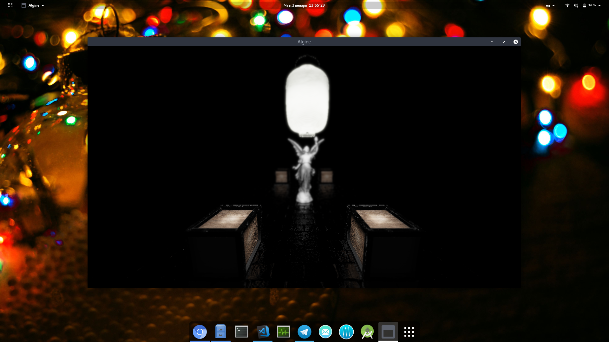

# Algine

Algine - OpenGL 3.3+ engine written in C++

**Supported platforms:** Linux, Android, Windows
 **Target platforms:** Linux (clang), Android

**Recommended toolchain:** clang + mold 

## Functionality

Short overview:

* Core
  * Textures
  * Framebuffers & Renderbuffers
  * Shaders & Shader programs
  * Buffers (Array, Index, Uniform etc)
  * Contexts / multithreading
  * Widgets (font rendering, canvas, layouts etc)
  * Logging
  * Debugging (including Algine SOP)
  * Custom shader preprocessor
  * Built-in GLSL modules and shaders
  * Platform-specific functionality
  * Lua as main scripting language (coming soon)
  * etc
* Std
  * Skeletal animations
  * Model loading (support of 40+ 3D model formats thanks to [Assimp](https://github.com/assimp/assimp))
  * Custom materials (amtl)
  * Cameras
  * Basic effects
  * etc
* Ext
  * Lighting
  * Shadow mapping

The engine has a modular design.

## Roadmap

Main goals for now (in priority order):

- [ ] [Lua as main scripting language](doc/lua.md)
  - [x] Creators
  - [ ] Core components (Engine, Texture2D, Framebuffer etc)
  - [ ] Widgets
  - [x] GLM classes (vec3, vec4, mat3, mat4, quat) and core functionality
  - [x] Replace JSON configs with Lua scripts
  - [x] Remove classes `Transferable` and `FileTransferable`
- [ ] Editor (UI: Lua + AlgineWidgets; Core: C++)

## Examples

Repository with my sandbox: [algine-examples](https://github.com/congard/algine-examples)

More examples will be published soon.

## Building

See [doc/build](doc/build/README.md)

## Contact

*   Telegram: [congard](https://t.me/congard)
*   Email: [dbcongard@gmail.com](mailto:dbcongard@gmail.com)

## Donate

<b>Payeer:</b> P36281059

Or you can do it even without finance. Just open [this](http://fainbory.com/8aWY) link

Thank you.
