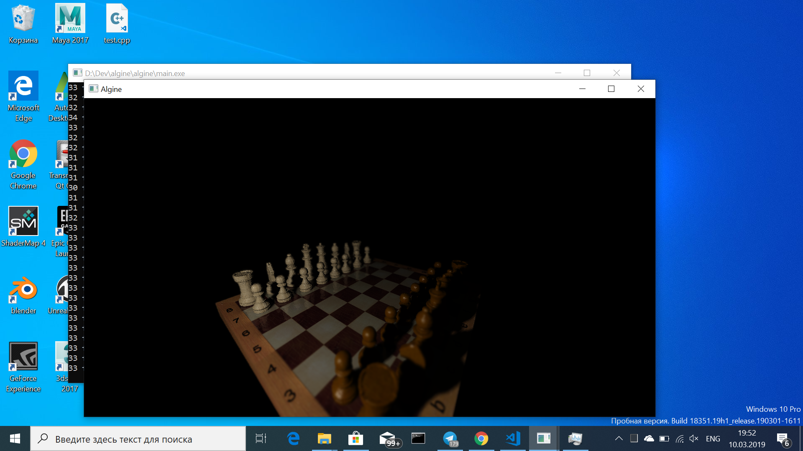

# Algine
Algine [Al'gine] - OpenGL 3.3+ engine written in C++

Version: 1.4.1 beta-candidate

Supported systems: Linux, Windows (with MinGW-w64)

Example of using given in `main.cpp` file

Engine tested on Asus x302uv (Intel Core I5-6200U, Nvidia GeForce 920mx, 8GB RAM, Debian GNU/Linux buster/sid, 1920x1080 screen) and showed good results

If you find any errors or you have recommendations for improving the project - a big one please let me know!

Shaders are written with the expectation that the compiler optimizes their code. In the future, the optimizer may be written

# Functionality
 * Textures
 * Mapping (ambient, diffuse, specular, normal)
 * Lighting (with a huge number of properties)
 * Colorful lighting
 * Unlimited count of light sources
 * Shadow mapping
 * Soft shadows
 * Point lighting
 * Bloom
 * Depth of field (DOF)
 * SSR (Screen Space Reflections)
 * Cinematic Depth of field
 * Support of 40+ 3D model formats (thanks to [Assimp](https://github.com/assimp/assimp))
 * Support of materials
 * Effect management
 * Etc.

Take into account, this is a test (beta-candidate) version! All major functions will be added in later versions.

# Dependencies
Engine has next dependencies: `glew`, `glfw`, `glm`, `assimp`.

Installation on Debian-based systems:

`sudo apt install libglew-dev libglfw3-dev libglm-dev`

Also you need `pkg-config` to compile using `make.sh` script

`sudo apt install pkg-config`

`pkg-config --libs glfw3 glew` output is `-lglfw -lGLEW -lGLU -lGL` (to compile project without `pkg-config`)

How to install assimp you can read [here](https://github.com/assimp/assimp/blob/master/Build.md)

# Compilation
1. `cd algine`
2. `chmod +x make.sh`
3. `./make.sh` - to run on standard videocard,`./make.sh primus` - to run on second videocard using `primusrun`, `./make.sh optimus` - to run on second videocard using `optirun`

**About compilation on Windows you can read [here](build.md)**

# Contact
You can contact me by telegram or email:
 * https://t.me/congard
 * dbcongard@gmail.com

# You can support me financially
<b>Payeer:</b> P36281059