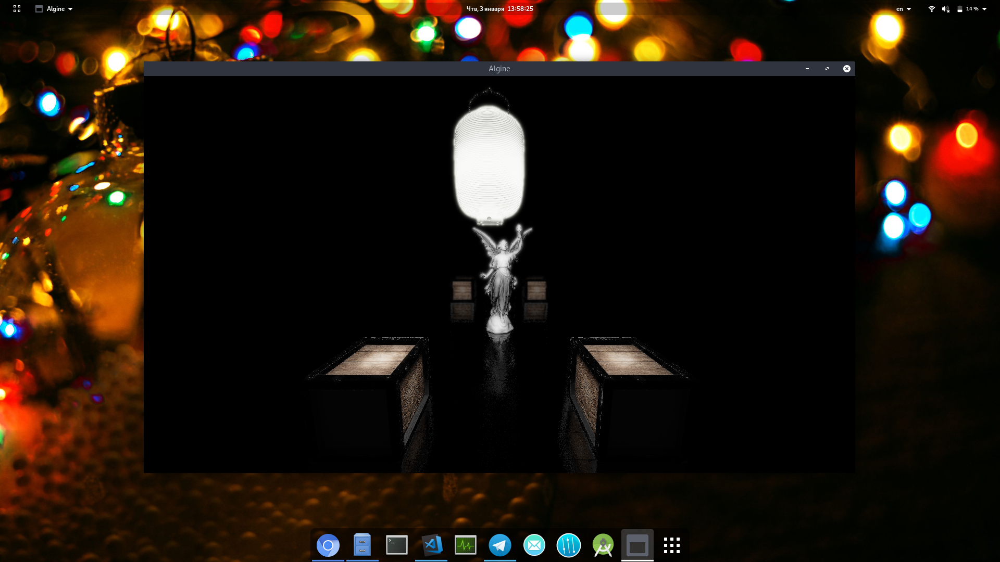

# Compiling on Windows
1. First, you must download and install [MinGW-w64](https://sourceforge.net/projects/mingw-w64/). This is required for compilation. Also you need to install [CMake](https://cmake.org/download/);
2. After successful installation, you need to add the `bin` folder to your `PATH`. For example, if you installed MinGW in `C:\mingw-w64`, then the path to the `bin` folder will look like this: `C:\mingw-w64\x86_64-8.1.0-posix-seh-rt_v6-rev0\mingw64\bin`. How to add a folder in the `PATH` you can read for example [here](https://docs.alfresco.com/4.2/tasks/fot-addpath.html);
3. Next, you need to download and install the following libraries: [glew](http://glew.sourceforge.net/), [glfw](https://www.glfw.org/download.html), [glm](https://github.com/g-truc/glm), [assimp](https://github.com/assimp/assimp). You can download precompiled binaries and use it if it exists. To build these libraries you need (you can find out more on the page of these libraries themselves):
    1. Open command line (with administrator privileges) in project directory
    2. Run `cmake -G "MinGW Makefiles" CMakeLists.txt`
    3. Run `mingw32-make`
    4. Run `mingw32-make install`
4. Next you need to install the resulting `.dll`:
    1. Copy `.dll` files to `C:\Windows\System32`
    2. Run `regsvr32 filename.dll`
5. Building Algine example:
    1. CMake: just open IDE (CLion, QtCreator etc) and press on "Run" button!
    2. **DEPRECATED**:
        1. Check `scripts\algine.bat` file. Be sure that all directories are right;
        2. Open a command prompt in the root Algine folder. Run `start scripts\algine.bat compile`. It will start compilation. If you did everything right, you will see the following message: *Compilation done*
        3. Just type `start scripts\run.bat`. If you did everything right, you will see Algine window with the scene :)

If I'm forgot something in this instruction, please notify me